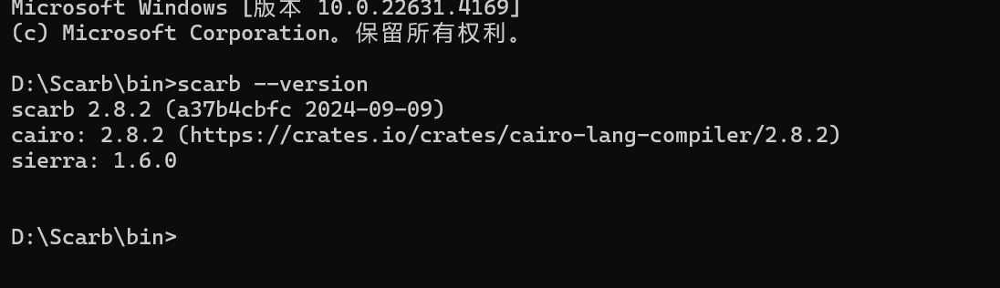

> 请在上边的 timezone 添加你的当地时区，这会有助于你的打卡状态的自动化更新，如果没有添加，默认为北京时间 UTC+8 时区
> 时区请参考以下列表，请移除 # 以后的内容

timezone: Pacific/Honolulu # 夏威夷-阿留申标准时间 (UTC-10)

timezone: America/Anchorage # 阿拉斯加标准时间 (UTC-9)

timezone: America/Los_Angeles # 太平洋标准时间 (UTC-8)

timezone: America/Denver # 山地标准时间 (UTC-7)

timezone: America/Chicago # 中部标准时间 (UTC-6)

timezone: America/New_York # 东部标准时间 (UTC-5)

timezone: America/Halifax # 大西洋标准时间 (UTC-4)

timezone: America/St_Johns # 纽芬兰标准时间 (UTC-3:30)

timezone: America/Sao_Paulo # 巴西利亚时间 (UTC-3)

timezone: Atlantic/Azores # 亚速尔群岛时间 (UTC-1)

timezone: Europe/London # 格林威治标准时间 (UTC+0)

timezone: Europe/Berlin # 中欧标准时间 (UTC+1)

timezone: Europe/Helsinki # 东欧标准时间 (UTC+2)

timezone: Europe/Moscow # 莫斯科标准时间 (UTC+3)

timezone: Asia/Dubai # 海湾标准时间 (UTC+4)

timezone: Asia/Kolkata # 印度标准时间 (UTC+5:30)

timezone: Asia/Dhaka # 孟加拉国标准时间 (UTC+6)

timezone: Asia/Bangkok # 中南半岛时间 (UTC+7)

timezone: Asia/Shanghai # 中国标准时间 (UTC+8)

timezone: Asia/Tokyo # 日本标准时间 (UTC+9)

timezone: Australia/Sydney # 澳大利亚东部标准时间 (UTC+10)

timezone: Pacific/Auckland # 新西兰标准时间 (UTC+12)

# CavnHan

1. 自我介绍
   CavnHan 有Java、Gosolidity的开发经验，有几年web2开发经验，现在在学习web3，希望进入web3是世界谋求发展，并找到工作，做几个项目


2. 你认为你会完成本次残酷学习吗？
   我认为我会完成本次残酷学习，因为我有信心，并且我相信我能够克服任何困难。

## Notes

<!-- Content_START -->

### 2024.09.18

#### Cairo环境安装

1. 什么是Cairo:

   简单来说，Cairo 是一种 **专门为 Starknet 设计的编程语言**。它就像一个 **魔法阵**，可以让你 **高效地编写智能合约**，而且 **安全可靠**！

   它 **基于 Solidity**，但是 **更加简洁高效**，而且 **专注于零知识证明**。 就像你用魔法笔画出魔法阵，就能创造出神奇的物品一样，Cairo 语言让你可以 **编写出安全可靠的智能合约**。

   **Cairo 语言的特性：**

   - 
   - **简洁易学：** Cairo 语言的语法简洁，容易学习，即使是新手也能很快上手。
   - **安全可靠：** Cairo 语言 **专注于安全**，它 **内置了安全机制**，可以 **防止常见的漏洞**，确保你的智能合约更加安全可靠。
   - **高效执行：** Cairo 语言 **优化了执行效率**，可以 **快速执行智能合约**，让你的应用运行更加流畅。
   - **零知识证明：** Cairo 语言 **与 Starknet 的零知识证明技术完美结合**，可以 **验证合约的执行结果**， **提高安全性**。

   **想象一下，你用 Cairo 语言可以做什么呢？**

   - 
   - **构建去中心化的金融应用（DeFi）：** 例如，可以开发去中心化的借贷平台、稳定币系统等等。
   - **创建去中心化的游戏：** 可以开发区块链游戏，让游戏中的资产和道具更加安全可靠。
   - **构建数据隐私应用：** 可以利用 Cairo 语言和 Starknet 的零知识证明技术，保护用户隐私。
   - **开发各种各样的去中心化应用（dApps）：** 例如，可以构建社交网络、电商平台等等。

   总而言之，Cairo 语言就像一个 **魔法工具**，可以让你在 Starknet 上 **创造各种神奇的应用**！ 它 **简洁易学、安全可靠、高效执行**，是 **构建未来 Web3 应用** 的绝佳选择！ ✨

2. 安装Scarb:

   Scarb 是[Cairo包管理器。Scarb 会下载 Cairo 包的依赖项、编译您的项目（纯 Cairo 或 StarkNet 合约），并作为其他工具（如](https://cairo-lang.org/)[Starknet Foundry](https://foundry-rs.github.io/starknet-foundry)或 IDE）处理您的代码的入口点。

   Scarb 深受[Cargo](https://doc.rust-lang.org/cargo/)的启发。其目标是习惯使用 Rust 的分析师轻松自在。

   [下载地址](https://docs.swmansion.com/scarb/download.html#precompiled-packages)

   Windows:

   配置环境变量，系统属性环境变量，path添加安装路径，例：D:\Scarb\bin

   验证：

   

   Linux:

   安装asdf:

   https://asdf-vm.com/guide/getting-started.html

   安装scarb:   

   ```bash
   asdf plugin add scarb
   ```
   
   安装vscode插件：
   
   

### 2024.09.19


#### Cairo学习

1. 创建项目

   ```bash
   scarb new hello_world
   ```

   

2. 构建项目

   ```bash
   scarb build
   ```

   

3. 运行项目

   ```bash
   scarb cairo-run
   ```

   

4. 变量和可变性

### 2024.09.20

笔记内容

### 2024.09.21

笔记内容

### 2024.09.22

笔记内容

### 2024.09.23

笔记内容

### 2024.09.24

笔记内容

### 2024.09.25

笔记内容

### 2024.09.26

笔记内容

### 2024.09.27

笔记内容

### 2024.09.28

笔记内容

### 2024.09.29

笔记内容

### 2024.09.30

笔记内容

### 2024.10.01

笔记内容

### 2024.10.02

笔记内容

### 2024.10.03

笔记内容

### 2024.10.04

笔记内容

### 2024.10.05

笔记内容

### 2024.10.06

笔记内容

### 2024.10.07

笔记内容

### 2024.10.08

笔记内容

### 2024.10.09

笔记内容

### 2024.10.10

笔记内容

### 2024.10.11

笔记内容

### 2024.10.12

笔记内容

<!-- Content_END -->

