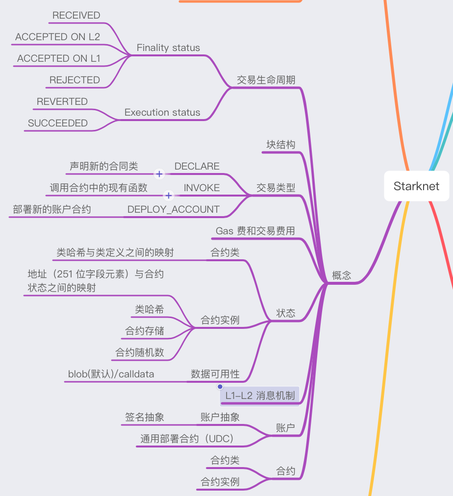

---

# Phipupt

1. 自我介绍  
   接触 web3 挺长时间了，一直浅尝则止。希望借这个机会深入学习下 Starknet 和 zk  
   ps：目前正在参与 [Web3-CTF-Intensive-CoLearning](https://github.com/DeFiHackLabs/Web3-CTF-Intensive-CoLearning)
2. 你认为你会完成本次残酷学习吗？  
   没问题

## Notes

<!-- Content_START -->

### 2024.09.18

[Starknet Book](https://book.starknet.io/index.html) 已经不维护了，内容已整合到官方文档。因此，接下来参考[官方文档](https://docs.starknet.io/)学习

第一天先下载钱包、安装开发环境

1. 钱包插件  
   [Argent](https://www.argent.xyz/argent-x)   
   [Braavos](https://braavos.app/download-braavos-wallet/)

   在[这里](https://starknet-faucet.vercel.app/)领取测试网的 ETH

2. 区块链浏览器
   - [Starkscan](https://starkscan.co/)
   - [Starknet](https://viewblock.io/starknet)
   - [Voyager](https://voyager.online/)

3. 开发工具
- [Starkli](https://book.starkli.rs/)： 命令行界面与 Starknet 进行交互

   安装：
   ```
   curl https://get.starkli.sh | sh
   starkliup
   ```

- [Scarb](https://docs.swmansion.com/scarb/)： Cairo 和 Starknet 的生态系统的构建工具链和包管理器

   安装：
   ```
   curl --proto '=https' --tlsv1.2 -sSf https://docs.swmansion.com/scarb/install.sh | sh
   ```

### 2024.09.19
昨天部署了开发环境，领了水。今天开始尝试部署合约，发现 Foundry 开发框架推出了 Starknet 版本。考虑到在以太坊上的用的比较熟了，我决定使用 Foundry 来部署合约。

Starknet Foundry 使用：

- 安装

   ```
   curl -L https://raw.githubusercontent.com/foundry-rs/starknet-foundry/master/scripts/install.sh | sh

   snfoundryup
   ```

- 初始化项目

   ```snforge init hello_world```


- 运行测试

   ```snforge test```

待续...


### 2024.09.20
今天阅读[官方文档](https://docs.starknet.io/)，整理了一些 Starknet 相关概念



<!-- Content_END -->
