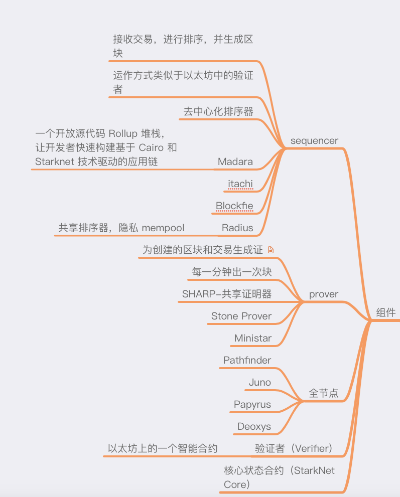

---

# Phipupt

1. 自我介绍  
   接触 web3 挺长时间了，一直浅尝则止。希望借这个机会深入学习下 Starknet 和 zk  
   ps：目前正在参与 [Web3-CTF-Intensive-CoLearning](https://github.com/DeFiHackLabs/Web3-CTF-Intensive-CoLearning)
2. 你认为你会完成本次残酷学习吗？  
   没问题

## Notes

<!-- Content_START -->

### 2024.09.18

[Starknet Book](https://book.starknet.io/index.html) 已经不维护了，内容已整合到官方文档。因此，接下来参考[官方文档](https://docs.starknet.io/)学习

第一天先下载钱包、安装开发环境

1. 钱包插件  
   [Argent](https://www.argent.xyz/argent-x)   
   [Braavos](https://braavos.app/download-braavos-wallet/)

   在[这里](https://starknet-faucet.vercel.app/)领取测试网的 ETH

2. 区块链浏览器
   - [Starkscan](https://starkscan.co/)
   - [Starknet](https://viewblock.io/starknet)
   - [Voyager](https://voyager.online/)

3. 开发工具
- [Starkli](https://book.starkli.rs/)： 命令行界面与 Starknet 进行交互

   安装：
   ```
   curl https://get.starkli.sh | sh
   starkliup
   ```

- [Scarb](https://docs.swmansion.com/scarb/)： Cairo 和 Starknet 的生态系统的构建工具链和包管理器

   安装：
   ```
   curl --proto '=https' --tlsv1.2 -sSf https://docs.swmansion.com/scarb/install.sh | sh
   ```

### 2024.09.19
昨天部署了开发环境，领了水。今天开始尝试部署合约，发现 Foundry 开发框架推出了 Starknet 版本。考虑到在以太坊上的用的比较熟了，我决定使用 Foundry 来部署合约。

Starknet Foundry 使用：

- 安装

   ```
   curl -L https://raw.githubusercontent.com/foundry-rs/starknet-foundry/master/scripts/install.sh | sh

   snfoundryup
   ```

- 初始化项目

   ```snforge init hello_world```


- 运行测试

   ```snforge test```

待续...


### 2024.09.20
今天阅读[官方文档](https://docs.starknet.io/)，整理了一些 Starknet 相关概念


### 2024.09.21
今天整理了一些 Starknet 生态项目


### 2024.09.22
今天整理了一些 Starknet 组件



### 2024.09.23
一些开发需要用到的资源：
- [vscode Cairo 扩展](https://marketplace.visualstudio.com/items?itemName=starkware.cairo1)，提供在编写 Cairo 智能合约时的帮助
- [starknet-devnet-rs](https://github.com/0xSpaceShard/starknet-devnet-rs) 使用 Rust 开发的 Starknet 本地测试节点
- [Katana](https://book.dojoengine.org/toolchain/katana) 由 Dojo 团队开发的一个极其快速的开发网络。可以将 Katana 用作通用开发网络

Starknet Foundry 居然还没有本地节点？


### 2024.09.24
starknet-devnet-rs 使用

安装：
```
cargo install starknet-devnet
```

运行节点：
```
starknet-devnet
```

加载环境变量
```
SEED=10 starknet-devnet
```

从文件加载配置
```
source .my-env-file && starknet-devnet
```

RPC 调用(获取账户余额)：
```
curl -X POST --data '{
    "jsonrpc": "2.0",
    "id": "1",
    "method": "devnet_getAccountBalance",
    "params": {
        "address": "<address>",
        "unit": "WEI",
        "block_tag": "latest"
    }
}' http://127.0.0.1:5050/
```


### 2024.09.25
今天正式开始学习 Cairo。

Cairo 是第一个用于创建可证明程序的图灵完备语言，适用于一般计算。Cario 由 Rust 编写。Cairo 还引入了 Sierra，这是一种新的中间表示，确保每次 Cairo 运行都可以被证明。

Cairo 不仅仅是为区块链开发者而设。作为一种通用编程语言，它可以用于任何计算，这些计算可以在一台计算机上进行证明，并在其他硬件要求较低的机器上进行验证

1. 准备工作
   - 安装 Scarb（Cairo构建工具和包管理器） 
   - [安装 VSCode 扩展](https://marketplace.visualstudio.com/items?itemName=starkware.cairo1)


2. 参考
   - [Cairo 语言官网](https://www.cairo-lang.org/)


### 2024.09.26

Scarb：Cairo构建工具和包管理器

1. 安装
   建议通过 asdf 安装 Scarb，这是一个可以按项目管理多个语言运行时版本的 CLI 工具

   asdf 安装：
   ```
   git clone https://github.com/asdf-vm/asdf.git ~/.asdf --branch v0.14.1
   . "$HOME/.asdf/asdf.sh"
   ```

   使用 asdf 安装 scarb：
   ```
   asdf plugin add scarb
   ```

   安装特定版本 scarb：
   ```
   asdf install scarb 2.8.1
   ```

2. 使用
   使用 Scarb 创建项目：
   ```
   scarb new hello_world
   ```

   其他命令：
   - `scarb build`
   - `scarb test`
   - `scarb cairo-run`
   - `scarb fmt`


3. 参考
- [Scarb 官方文档](https://docs.swmansion.com/scarb/docs.html)

### 2024.09.27
Cairo 笔记：
在 Cairo 中，代码包被称为 crates

Cairo 使用不可变内存模型，这意味着一旦内存单元被写入， 它不能被覆盖，只能被读取。为了反映这种不可变的内存模型， 在Cairo 中，变量默认是不可变的。
Caironautes

felt252 Cairo 有三种主要的标量类型：felts、整数和布尔值

布尔值的大小为一个 felt252

Cairo 没有原生的字符串类型，但提供了两种处理字符串的方法：使用单引号的短字符串和使用双引号的字节数组。 Cairo 使用felt252来处理短字符串。由于felt252是 251 位的，短字符串限制为 31 个字符（31 * 8 = 248 位，这是适合 251 位的最大 8 的倍数）

Cairo 代码使用蛇形命名法作为函数和变量名称的常规风格，其中所有字母都是小写字母，且下划线用于分隔单词

Cairo 有三种循环：loop、while和for


### 2024.09.28

Cairo 笔记--字典(Dictionary)数据结构:

- Cairo提供了Felt252Dict<T>类型来实现字典功能,其中键的类型限定为felt252,值的类型可以自定义。
- 基本操作包括insert插入键值对和get获取值。
- Felt252Dict<T>通过维护一个entries列表来模拟可变内存,每次操作都会添加一个新entry。
- 字典的内部实现基于entry列表,每个entry包含key、previous_value和new_value。
- 字典操作的时间复杂度为O(n),n为entry数量。
- 通过"squashing"过程来验证字典操作的正确性。
- 字典在销毁时会自动调用squash操作。
- 提供了entry和finalize方法来手动操作entry。
- 对于复杂类型(如数组),可以使用Nullable<T>和Box<T>来存储。
- 存储数组时需要特殊处理,不能直接使用get方法,而要使用entry方式读取和修改。

### 2024.09.29
Cairo 笔记--所有权:

- Cairo 使用线性类型系统，限制值的使用以确保内存安全。
- 在 Cairo 中，所有权属于变量而非值，多个变量可以安全地引用相同的不可变值。
- 变量的所有者是能够读取（和写入）该变量的代码，而不是值本身。
- 变量在其范围内有效，当超出范围时会被销毁。
- 值的移动意味着将其传递给另一个函数，原有变量会被销毁并不可再用。
- Copy 特征允许无需创建新内存段即可复制简单类型，但复杂类型如数组则不能实现该特征。
- Cairo 中实现销毁的类型（如 Felt252Dict）必须在超出范围时进行“压缩”，以确保资源的正确释放。

Cairo 笔记--快照和引用：
- Cairo 编程语言使用所有权系统保护内存安全，避免在被移动后继续使用变量。
- 快照是一种不可变的视图，允许在时间的某一时刻查看变量的状态，不影响原始数据。
- 定义快照参数的函数可以在不改变原始数组的情况下，读取其长度。
- 通过 @ 操作符可以创建变量的快照，允许以只读方式传递数据。
- 若要将快照还原为常规变量，可以使用 desnap 操作符 *，但仅限于可复制类型。
- 可变引用通过 ref 修饰符传递，允许在函数内部修改变量，同时保持所有权。
- Cairo 编程语言确保传递的可变引用在函数结束后会自动返回所有权，避免了值的重复转移问题

### 2024.09.30

Cairo 笔记：

match：
Cairo 编程语言中的 match 控制流构造极具威力，能够通过模式匹配来决定执行的代码路径，从而简化条件判断的复杂性。
match语句不仅可以处理基本类型，还允许对用户定义的枚举和可选值的深层次匹配，提高了代码的表达能力和安全性。
此外，Cairo确保所有可能的匹配情况都得到处理，从而减少了潜在的错误。

模块系统：
- 软件包（Packages）：Scarb 的一个功能，让你构建、测试和分享 crate
- Crates：对应于单个编译单元的模块树。它有一个根目录，以及在该目录下的 lib.cairo 文件中定义的根模块
- 模块（Modules） 和 `use`： 让你控制项目的组织和范围
- 路径（Paths）： 一种命名项的方法，例如结构体、函数或模块


### 2024.10.01

Cairo 笔记：
- 泛型是开罗编程语言中用来处理类型重复的一种抽象工具。
- 函数可以使用泛型类型参数来处理多种具体类型，而无需在编译时知晓类型信息。
- 开发者可以通过泛型定义自己的类型、函数和特征，提升代码的通用性。
- 编译器在使用泛型时会为每个具体类型生成新的定义，尽管这样仍然会有编译时的代码重复。
- 当编写Starknet合约时，使用泛型处理多种类型可能会导致合约大小增加。
- 使用特征可以定义类型的行为，以确保泛型类型只接受特定的类型。
- 通过抽取代码逻辑到函数中，开发者可以有效减少代码重复，以便更容易进行修改和维护


### 2024.10.02

Cairo 笔记：
Cairo 编程语言中的 `panic` 函数用于处理程序运行时出现的不可恢复错误，虽然它无法修复错误，但可以终止程序并提供错误信息。
`panic` 的触发可以是意外的，如数组越界访问，也可以是故意调用。
相比之下，`panic_with_felt252` 函数提供了一种更简洁的方式来引发 `panic`，而 `nopanic` 注释可以确保某个函数不会引发错误


### 2024.10.03

Cairo 笔记：错误处理总结

1. 不可恢复错误与`panic`
- 使用`panic`函数处理意外问题，导致程序终止
- `panic_with_felt252`函数提供更简洁的panic方式
- `panic!`宏允许使用超过31字节的错误消息
- `nopanic`注解表示函数不会panic
- `panic_with`属性用于标记返回`Option`或`Result`的函数

2. 可恢复错误与`Result`
- `Result<T, E>`枚举有两个变体：`Ok(T)`和`Err(E)`
- `ResultTrait`提供了处理`Result`的方法：
  - `expect`和`unwrap`：提取`Ok`值或panic
  - `expect_err`和`unwrap_err`：提取`Err`值或panic
  - `is_ok`和`is_err`：检查`Result`的变体

3. `?`运算符
- 用于更简洁的错误处理
- 对`Ok`值进行解包，对`Err`值进行错误传播

关键点
- 使用`Result`处理可恢复错误
- 使用模式匹配或`?`运算符处理`Result`
- `panic`用于处理不可恢复的错误情况


### 2024.10.04

Cairo 笔记：测试

Cairo提供了全面的测试工具,可以帮助开发者编写可靠的代码:

1. 测试的重要性:测试可以确保代码按预期工作,即使在进行更改时也能保持功能。

2. 测试函数的结构:
   - 使用#[test]属性标记测试函数
   - 通常包含设置、运行被测代码、断言结果三个步骤

3. 断言宏:
   - assert!用于布尔条件
   - assert_eq!和assert_ne!用于相等性检查  
   - assert_lt!, assert_le!, assert_gt!, assert_ge!用于比较

4. should_panic属性:用于测试代码是否按预期触发panic

5. 过滤和忽略测试:
   - 可以运行单个测试或过滤测试
   - 使用#[ignore]属性忽略某些测试

6. 测试组织:
   - 单元测试:测试单个模块,可以测试私有函数
   - 集成测试:测试多个模块的交互,在tests目录下

7. 特殊功能:
   - 可以限制测试的gas使用
   - 可以测试递归函数和循环
   - 可以基准测试特定操作的gas使用

8. 测试私有函数:Cairo允许直接测试私有函数

9. 集成测试的组织:可以使用子模块来组织集成测试


### 2024.10.05

Cairo 笔记：Cairo 编程语言的一些高级特性:

1. 自定义数据结构
- 使用 Felt252Dict<T> 来模拟可变数据结构
- 实现了自定义的 UserDatabase 和 MemoryVec (动态数组)结构
- 实现了 Stack(栈)数据结构

2. 智能指针
- Box<T> 类型,用于在 boxed segment 中存储数据
- Box<T> 可以用来实现递归类型,如二叉树
- Box<T> 可以提高性能,通过传递指针而不是复制大量数据

3. Nullable<T> 类型
- 用于字典中存储不支持 zero_default 的类型

4. 运算符重载
- 通过实现特定 trait 来重载运算符
- 给出了 Potion 结构体重载加法运算符的例子


### 2024.10.06

1. 哈希函数
   - Cairo 中的两种哈希函数:Pedersen 和 Poseidon

2. 宏(Macros) 
   - Cairo 中的几种内联宏,如`consteval_int!`, `selector!`, `print!`等

3. 内联(Inlining)
   - 详细解释了内联的概念和在Cairo中的应用
   - 介绍了`#[inline]`属性的三种变体及其使用
   - 讨论了内联的决策过程和对代码优化的影响
   - 通过具体的代码示例和相应的Sierra及Casm代码,展示了内联的工作原理和优化效果

4. 额外优化
   - 编译器如何进行额外的代码优化,特别是在使用内联函数时


<!-- Content_END -->
